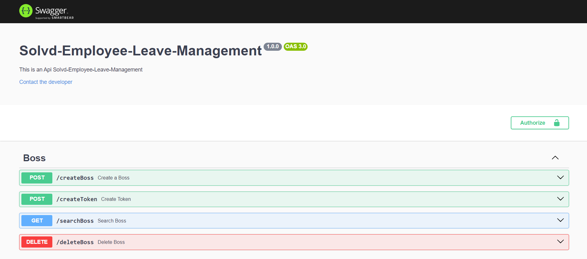
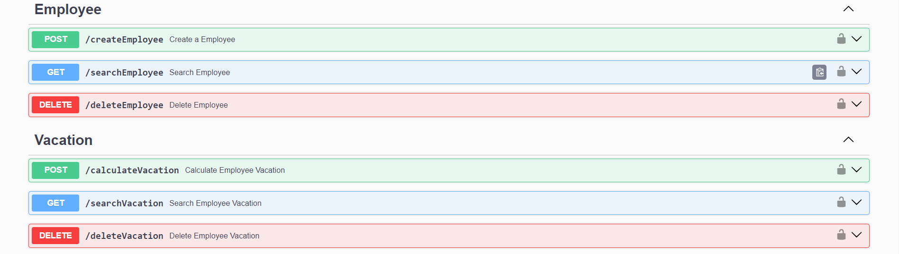

### Api Solvd-Employee-Leave-Management

    
    

### 💻 Project Description

- This project is an API, it must to be possible to calculate a vacation of a Employee's by your `startDate` and `baseSalary` at the company, so .. for this, need to create a `Boss`, and this boss need to authenticate with a `token`, for do all the functionalitis of this API, the functionalities are: 

##### You don't need to authenticate for run these end-points for the following module .

- Module `Boss`: (create a Boss, create Token, search a Boss and delete a Boss);

##### You need to authenticate for run this end-points for the following modules.

- Module `Employee`: (create a Employee, search a Employee and delete a Employee);
- Module `Vacation`: (Calculate a Vacation, search a Vacation and delete a Vacation);

### 🚀 Technologies

- Nodejs in version v20.15.0 (LTS)
- Postgres 
- Express
- JsonWebToken
- Swagger

### Base URL

`http://localhost:8080`

### 🚀 How to create and running the end-points

#### Routes of `Boss` Module.

##### CreateBoss: Post - `/createBoss`

- This route must recieve at the body of the http request the follow parameters: `name` and `password`.

- `name` type: string.
- `password` type: string.

- BaseURL example: `http://localhost:8080/createBoss`

##### CreateToken: Post - `/createToken`

- This route must recieve at the body of the http request the follow parameters: `name` and `password`, and must recieve through header of http request, by (query params) the parameter `boss_id`.

- `name` type: string.
- `password` type: string.
- `boss_id` type: string UUID.

- BaseURL example: `http://localhost:8080/createToken?boss_id=6ff0bbf3-248b-4ef1-9877-bf747b1ee715`

##### SearchBoss: Get - `/searchBoss`

- This route must recieve through header of http request, by (query params) the parameter `boss_id`.

- `boss_id` type: string UUID.

- BaseURL example: `http://localhost:8080/searchBoss?boss_id=e62850f1-e4cf-46e2-90e0-41b8c069c3ff`

##### DeleteBoss: Delete - `/deleteBoss`

- This route must recieve through header of http request, by (query params) the parameter `boss_id`.

- `boss_id` type: string UUID.

- BaseURL example: `http://localhost:8080/deleteBoss?boss_id=e62850f1-e4cf-46e2-90e0-41b8c069c3ff`

#### Routes of `Employee` Module.

##### CreateEmployee: Post - `/createEmployee`

- This route must recieve at the body of the http request the follow parameters: `employeeName`, `jobTitle`, `baseSalary` and `startDate`, and must recieve through header of http request, by (query params) the parameter `boss_id`, and also must recieve by (Bearer param) the `token`, so that it's possible to complete the end-point request.

- `employeeName` type: string.
- `jobTitle` type: string.
- `baseSalary` type: number (int or float)

- `startDate` type: string .... for this parameter the follow format must be passed .. example: `04/02/2024`, which means `04` month, `02` day and `2024` year, based on date US standard `mm/dd/yyyy`

- `boss_id` type: string UUID.

- BaseURL example: `http://localhost:8080/createEmployee?boss_id=0849d791-731d-4a93-9a42-c2e68cfb4e40`

##### SearchEmployee: Get - `/searchEmployee`

- This route must recieve through header of http request, by (query params) the parameter `employee_id`, and also must recieve by (Bearer param) the `token`, so that it's possible to complete the end-point request.

- `employee_id` type: string UUID.

- BaseURL example: `http://localhost:8080/searchEmployee?employee_id=b31833eb-c081-4400-bf9f-c12ce6e9e01a`

##### DeleteEmployee: Delete - `/deleteEmployee`

- This route must recieve through header of http request, by (query params) the parameter `employee_id`, and also must recieve by (Bearer param) the `token`, so that it's possible to complete the end-point request.

- `employee_id` type: string UUID.

- BaseURL example: `http://localhost:8080/deleteEmployee?employee_id=5115044b-2486-4a8e-8720-1ccc52b8522a`

#### Routes of `Vacation` Module.

##### CalculateVacation: Post - `/calculateVacation`

- This route must recieve through header of http request, by (query params) the parameter `employee_id`, and also must recieve by (Bearer param) the `token`, so that it's possible to complete the end-point request.

- `employee_id` type: string UUID.

- BaseURL example: `http://localhost:8080/calculateVacation?employee_id=7976abab-9358-42ba-b017-32019b6c6024`

##### SearchVacation: Get - `/searchVacation`

- This route must recieve through header of http request, by (query params) the parameter `vacation_id`, and also must recieve by (Bearer param) the `token`, so that it's possible to complete the end-point request.

- `vacation_id` type: string UUID

- BaseURL example: `http://localhost:8080/searchVacation?vacation_id=5994f067-764f-4c98-8018-74c4329cbaf7`

##### DeleteVacation: Delete - `/deleteVacation`

- This route must recieve through header of http request, by (query params) the parameter `vacation_id`, and also must recieve by (Bearer param) the `token`, so that it's possible to complete the end-point request.

- `vacation_id` type: string UUID

- BaseURL example: `http://localhost:8080/deleteVacation?vacation_id=55e29f5a-1dd2-4770-af21-0cf507a02a24`

### 🚀 How to running this application Localy

- Copy the url of this repo in tab `< > CODE`, and running in terminal .... `git clone "link...."`
- Go to project folder .... `cd Solvd-Employee-Leave-Management`
- Install dependencies .... `npm install` or `yarn install`, depends on the installed package manager.
- You will need to create a database with any name that you want, and run the scripts for create the tables that is in a file `tables.sql` of this application, in your tool for manipulate the database `postgres`.
- You will need to create a `.env` file on `root` of this application, and copy the environment variables that is in `.env.example` of this application.  

### 🚀 How to running this application in docker container

- For running application in Docker container you should have docker installed on your system.

- Copy the url of this repo in tab `< > CODE`, and running in terminal .... `git clone "link...."`
- Go to project folder .... `cd Solvd-Employee-Leave-Management`
- Install dependencies .... `npm install` or `yarn install`, depends on the installed package manager.
- You will need to run the scripts for create the tables that is in a file `tables.sql` of this application, in your tool for manipulate the database `postgres`.   
- You will need to create a `.env` file on `root` of this application, and copy the environment variables that is in `.env.example` of this application. 

- After following check the steps above, you can running the application with the follow comand `docker compose up`.
- For stop you can use the follow comand `docker compose down`.

### 🚀 How to running the `swagger` Documentation of this application

- Go to your web brownser and type the follow url .... `http://localhost:8080/api-doc`